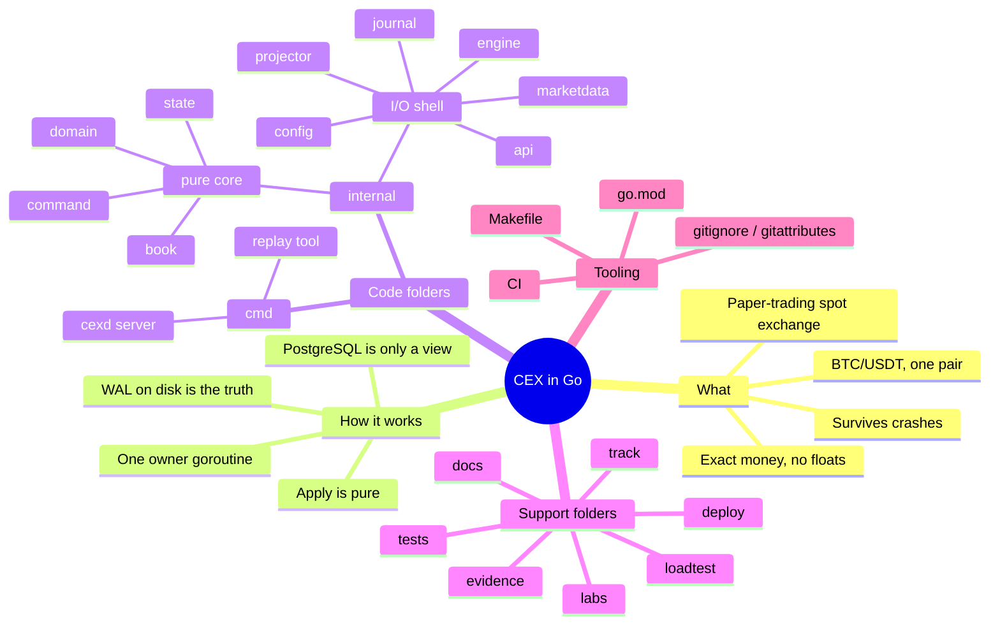

# 1 October 2026: Day 1, building the skeleton

> **One-line summary:** today no trading code was written. We built the
> *house plan and the empty rooms*: every folder, every package and its
> job, the decisions behind them, and a tiny server that starts and stops
> correctly. Every later day fills one of these rooms.

Read this file top to bottom once. Afterwards, use section 4 (the folder
map) as a lookup table whenever you forget why something exists.

---

## 1. The mind map



The same thing as plain text, in case Mermaid doesn't render:

```
CEX in Go
├── WHAT: paper exchange, BTC/USDT, exact integer money, crash-safe
├── HOW:  one owner goroutine → WAL (disk) → pure Apply → reply
├── CODE
│   ├── cmd/        programs you can run (cexd = server, replay = inspector)
│   └── internal/   the actual logic, private to this repo
│       ├── PURE CORE (no disk, network or clock: just logic)
│       │   ├── domain    the vocabulary: Price, Qty, money math
│       │   ├── command   the messages: "place order", "cancel", "fund"
│       │   ├── book      the order book + matching
│       │   └── state     everything together + Apply()
│       └── SHELL (talks to the outside world)
│           ├── journal     writes commands to disk (WAL)
│           ├── engine      the one goroutine that runs everything in order
│           ├── api         HTTP endpoints
│           ├── marketdata  live order book over WebSocket
│           ├── projector   copies history into PostgreSQL
│           └── config      reads settings from env variables
├── SUPPORT: docs, track, tests, loadtest, deploy, labs, evidence
└── TOOLING: go.mod, Makefile, CI, .gitignore, .gitattributes, .editorconfig
```

---

## 2. What we are building, in plain words

An exchange is a place where people say "I want to buy 0.1 BTC at
60,000 USDT" or "I want to sell 0.1 BTC at 60,000 USDT", and a **matching
engine** pairs them up. Ours is a *simulator*: the money is fake, but the
engineering is real.

Three things make it hard, and they drive every design choice:

1. **Money must be exact.** If 0.1 + 0.2 becomes 0.30000000000000004,
   someone's balance is wrong. → We use integers only (ADR-0002).
2. **Order must be fair and repeatable.** Two people clicking at once must
   get a clear, recorded order. → A single owner gives each command a
   sequence number (ADR-0001).
3. **A crash must not lose or double money.** → Every command is written
   to disk *before* it is applied, so after a crash we replay the disk
   log and arrive at exactly the same state (the WAL).

---

## 3. The architecture and *why* it looks this way

### The life of one order (the most important picture)

```
 You (HTTP)                                                          Disk
    │  POST /v1/orders {"price":"60000","quantity":"0.1"}
    ▼
 ┌──────┐  check input, turn "0.1" into 1000 lots
 │ api  │──────────────────────────────┐
 └──────┘                              ▼
                              bounded queue (channel)
                                       │   full? → 503 "busy, retry"
                                       ▼
 ┌─────────────────────────── engine (ONE goroutine) ───────────────────┐
 │ 1. give it seq #1042 + timestamp      ← this decides who was "first"  │
 │ 2. journal.Append + Sync  ────────────────────────────────────────────┼──► data/wal
 │ 3. state.Apply(cmd)  → reserve money → match in book → ledger         │
 │ 4. send the result back                                               │
 └───────────────────────────────────────────────────────────────────────┘
    │
    ▼
 You get: {"order_id":"77","status":"filled","applied_seq":"1042"}
```

### Why one goroutine owns everything (instead of many with locks)

| With many goroutines + locks | With one owner goroutine (our choice) |
|---|---|
| Alice's USDT is used by BTC and ETH orders at the same time, so you need locks everywhere | Only one goroutine ever touches balances, so no locks are needed |
| Hard to say exactly what order things happened in | Every command has a sequence number |
| Replaying after a crash may give a different result | Same commands in the same order give the same result, every time |
| Harder to reason about and test | `Apply` is a normal function you can unit-test |

The cost is that one goroutine is a speed ceiling. We'll **measure** it in
week 7 instead of guessing. For learning and correctness, it's the right
trade-off.

### Why the WAL (write-ahead log) is the "truth"

The WAL is a file on disk that only grows. Every command is written to it
and `fsync`ed (forced onto the physical disk) **before** we apply it. So:

- crash after writing? → on restart, read the log, re-apply, same state ✔
- crash before writing? → the client never got "success", so they retry ✔
- PostgreSQL deleted? → rebuild it from the log ✔

That's why `journal` is the most precious package and PostgreSQL is "just
a view".

### Why `Apply` must be "pure"

Pure means *same input → same output, no side effects*: no reading the
clock, no random numbers, no disk, no network inside `Apply`. If `Apply`
called `time.Now()`, replaying yesterday's log today would give different
results and recovery would break. That is why the engine stamps the time
*into the command* before it's written to disk.

### Pure core vs. I/O shell (the import rule)

```
   SHELL (can do I/O)          CORE (pure logic)
   cmd, api, engine,    ──►    state ──► book ──► domain
   journal, projector,         command ──────────► domain
   marketdata, config
```

Arrows mean "imports". The core **never** imports the shell. This makes
the core trivially testable (no database or network needed) and keeps it
reusable: the server, the replay tool and the projector all use the same
core. Go refuses to compile import cycles, so mistakes show up instantly.

---

## 4. Every folder: what it is and why it exists

### Root files

| File | What it does | Why we need it |
|---|---|---|
| `go.mod` | Declares the module name `github.com/SrijitGyawali/Centralized-Exchange` and the Go version `1.26.5` | Go uses the module name as the start of every import path. Pinning the version means your laptop, CI and Docker all use the same compiler. |
| `.gitignore` | Lists files git should never track: `bin/`, `data/`, `*.wal`, `.env`… | Binaries can be rebuilt, WAL data isn't source code, and secrets must never reach GitHub. |
| `.gitattributes` | Forces LF line endings; marks `*.wal` as binary | You're on Windows (CRLF). gofmt wants LF, and if git "fixed" line endings inside a WAL file its checksum would break. |
| `.editorconfig` | Tabs for Go, spaces for YAML/Markdown | Every editor formats the same way. |
| `.env.example` | Lists every config variable with defaults | A new developer sees all settings in one place. The real `.env` is ignored by git. |
| `Makefile` | Shortcuts: `make run`, `make test`, `make check`… | You type less. Each target is just a `go` command, so reading it teaches you the real tools. |
| `.github/workflows/ci.yml` | GitHub runs format check, vet, build and race tests on every push | Catches mistakes automatically, even when you forget to run tests. |
| `README.md` | The front page of the repo | The first thing anyone (an interviewer, too) reads. |

### `cmd/`: the programs you can run

Go convention: **each folder under `cmd/` is one executable** with its own
`package main` and `func main()`.

| Folder | What it is | Why |
|---|---|---|
| `cmd/cexd` | The exchange server ("cex daemon"). Today it starts, serves `/healthz` and `/readyz`, and shuts down cleanly on Ctrl-C. | It is the **composition root**: the only place that reads env variables and *connects* all packages. No business logic lives here, because code in `main` can't be imported or easily tested. |
| `cmd/replay` | A command-line tool that will read the WAL and replay it offline, e.g. "explain order 42". Today it only parses flags. | Debugging and interview demos: you can show exactly why an order filled the way it did, without touching the live server. |

### `internal/`: all the real code

Go rule: **packages inside `internal/` can only be imported by code in
this same repo.** The compiler enforces it, so we are free to change
anything without breaking outside users. We have no `pkg/` folder because
we aren't publishing a library.

#### The pure core (just logic, easy to test)

| Package | Job, in one sentence | Example of what will live here |
|---|---|---|
| `domain` | The vocabulary: what a price, quantity and amount of money *are*, plus safe math. | `type Price int64`, `ParseQty("0.1") → 1000 lots`, `Notional(price, qty)` that errors instead of overflowing |
| `command` | The messages that change state, as plain data. | `PlaceOrder{User, Side, Price, Qty, ClientKey}`, `CancelOrder{…}`, `Result{Status, Fills}` |
| `book` | One trading pair's order book and the matching algorithm. | Bids sorted high→low, asks low→high, FIFO queue per price; "match this incoming buy" |
| `state` | *Everything* together (books + balances + ledger + dedupe) and the one function that changes it. | `func (s *State) Apply(cmd) Result` |

Why is `command` separate from `state`? `journal` must *save* commands. If
commands lived in `state`, `journal` would have to import `state`, which
pulls in the whole matching engine just to write bytes to a file. A small
leaf package keeps the dependency graph clean.

#### The shell (talks to disk, network, time)

| Package | Job, in one sentence | Why it's separate |
|---|---|---|
| `journal` | Writes commands to the WAL file and reads them back after a crash. | Disk I/O, checksums and corruption handling form a project of their own (week 4). |
| `engine` | The single goroutine: takes commands from a queue, numbers them, saves them, applies them, replies. | Concurrency lives in **one** place, so everywhere else stays simple. |
| `api` | HTTP: checks input, converts JSON to commands, converts results to JSON with the right status codes. | Untrusted input is validated at the edge, so bad data never reaches the engine. |
| `marketdata` | Sends the live order book to browsers over WebSocket. | Slow clients must never slow down matching, so they get their own buffers and are disconnected if they lag. |
| `projector` | Copies orders, trades and ledger history into PostgreSQL for queries. | SQL is great for "show my last 100 trades", but it is *not* the source of truth and can be rebuilt from the WAL. |
| `config` | Reads `CEX_HTTP_ADDR`, `CEX_DATA_DIR`… into a typed struct and validates it. | Only one package touches the environment, so everything else gets plain values and is easy to test. |

### Support folders

| Folder | What goes in it | Why |
|---|---|---|
| `docs/` | `ARCHITECTURE.md` (the big design), `adr/` (decision records), `plan/` (your master plan) | Design written down *before* code. ADRs answer "why did we choose X?" months later. |
| `docs/adr/` | ADR-0000 template, ADR-0001 (scope + one owner), ADR-0002 (integer money units) | Interviewers love "here's the decision, the alternatives and the trade-off". |
| `track/` | This folder: one dated folder per working day | Your personal learning trail: what you did, and why. |
| `tests/` | Big tests that cross packages: crash tests, end-to-end, recovery | Small unit tests live next to their code (`book_test.go` beside `book.go`). This folder holds tests of the whole system. |
| `loadtest/` | Scripts that send lots of orders to measure speed (week 7) | Performance claims must be measured, never guessed. |
| `deploy/` | Dockerfile and docker-compose (week 7) | Run the whole system (server + Postgres + Grafana) with one command. |
| `labs/` | Small Go experiments: GC, scheduler, slices, race detector… | Learn Go internals without stuffing experiments into the product. |
| `evidence/` | Benchmark output, profiles, crash reports, demo videos | Proof that your README claims are true. |

---

## 5. The Go ideas you met today (and where)

| # | Idea | Where to see it | In one line |
|---|---|---|---|
| 1 | Modules | `go.mod` | Module path + pinned version = reproducible imports and builds |
| 2 | `cmd/` and `internal/` | folder layout | Executables vs. private code that the compiler protects |
| 3 | Package docs | every `doc.go` | The comment above `package x` is what `go doc` prints |
| 4 | Composition root | `cmd/cexd/main.go` | Only `main` wires things together |
| 5 | `main` → `run() error` | `cmd/cexd/main.go` | `os.Exit` skips `defer`s, so only `main` exits and `run` is testable |
| 6 | Pass functions, not globals | `config.Load(getenv)`, `api.NewRouter(ready)` | Tests pass fake functions, so no framework is needed |
| 7 | Closures | `handleReadyz(ready)` returns a handler | A function that remembers a variable from where it was created |
| 8 | Table-driven tests | `config_test.go`, `health_test.go` | A list of cases looped through with `t.Run`, the standard Go style |
| 9 | `httptest` | `health_test.go` | Test HTTP handlers with no real network |
| 10 | Context + signals | `signal.NotifyContext` in `run` | Ctrl-C becomes "context canceled", which everything can watch |
| 11 | Buffered channel against goroutine leaks | `serveErr := make(chan error, 1)` | The sender never blocks forever, even if nobody reads |
| 12 | Race detector | `syncBuffer` in `main_test.go`, `make race` | Finds two goroutines touching the same memory unsafely |
| 13 | Error wrapping | `fmt.Errorf("…: %w", err)`, `errors.Join` | Add context and keep the original error checkable |
| 14 | Server timeouts | `http.Server{ReadTimeout: …}` | A zero value means "wait forever", a real production bug |

---

## 6. Health vs. readiness (asked a lot in interviews)

- **`/healthz` (liveness)**: "Is the process alive?" If this fails,
  Docker/Kubernetes **restarts** the process. It must not check the
  database, or a 5-second DB hiccup would restart a perfectly good
  exchange.
- **`/readyz` (readiness)**: "Should I send traffic here?" If this fails,
  the process keeps running but gets no traffic, e.g. while replaying
  the WAL after a restart. Today it always returns 503 because there is
  no engine yet. That's honest.

---

## 7. Money in integers (ADR-0002), worked example

| Thing | Smallest unit | So… |
|---|---|---|
| BTC quantity | 1 lot = 0.0001 BTC | 0.1 BTC = 1,000 lots |
| USDT money | 1 atom = 0.000001 USDT | 1 USDT = 1,000,000 atoms |
| Price | 1 tick = 1 USDT per BTC | 60,000 USDT = 60,000 ticks |

**Cost of an order = price × qty × 100 atoms**

Buy 0.1 BTC at 60,000 → 60,000 × 1,000 × 100 = 6,000,000,000 atoms = **6,000 USDT** ✔

Try it: 0.25 BTC at 61,500 → 61,500 × 2,500 × 100 = 15,375,000,000 atoms
= **15,375 USDT**.

---

## 8. How to run what exists today

```bash
make run                      # start the server (Ctrl-C to stop gracefully)
curl localhost:8080/healthz   # → ok
curl -i localhost:8080/readyz # → 503 not ready: engine not started
make check                    # gofmt + vet + race tests (same as CI)
go doc ./internal/engine      # read any package's contract
```

Windows note: `kill` from Git Bash stops the process abruptly, with no
graceful shutdown. Use **Ctrl-C** to see the "stopped cleanly" log.

---

## 9. Check yourself (answer without looking)

1. Why does only `cmd/cexd` read environment variables?
2. Why is `command` its own package?
3. What does "pure" mean for `Apply`, and what would break if it called
   `time.Now()`?
4. Why is PostgreSQL *not* the source of truth?
5. Difference between `/healthz` and `/readyz`?
6. Why is `serveErr` buffered with capacity 1?
7. How many atoms is 0.5 BTC at 50,000?
   (50,000 × 5,000 × 100 = 25,000,000,000 = 25,000 USDT)

---

## 10. Tomorrow (week 1, session 2)

Fill the `internal/domain` room:

- `Price`, `Qty`, `Atoms` types
- `ParsePrice("60000")`, `ParseQty("0.1")`: string → integer, never float
- `Notional(price, qty)` with an overflow check
- tests first: zero, negative, too many decimals, huge numbers, `"1e5"`, `""`
